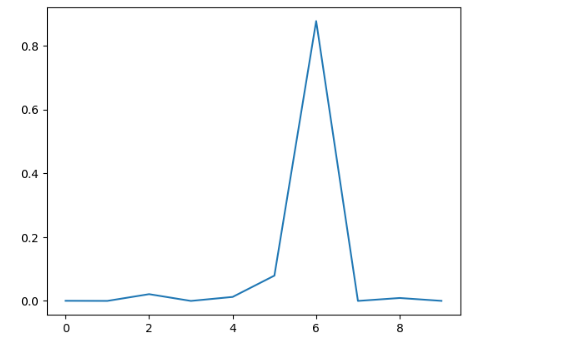

# handwritten-digit-classifier-mnist

A simple neural network–based project to classify handwritten digits (0–9) using the **MNIST dataset**.  
This repository demonstrates the complete ML pipeline: data preprocessing, model training, evaluation, and prediction visualization.

---

## Overview

- **Task:** Handwritten digit classification
- **Dataset:** MNIST
- **Image Size:** 28 × 28 (grayscale)
- **Classes:** 10 (digits 0–9)
- **Framework:** TensorFlow (Keras API)

---

## Dataset

- **Training Samples:** 60,000
- **Test Samples:** 10,000
- **Image Resolution:** 28 × 28
- **Pixel Value Range:** 0–255

The MNIST dataset is loaded using `tensorflow.keras.datasets`.

---

## Data Preprocessing

- Images reshaped from **28×28 → 784-dimensional vectors**
- Labels converted to **one-hot encoded vectors**
- **Z-score normalization** applied:

```python
X_norm = (X - mean) / (std + epsilon)
```

---

## Model Architecture

- Dense layer with **128 units** and **ReLU** activation
- Dense layer with **128 units** and **ReLU** activation
- Output layer with **10 units** and **Softmax** activation

---

## Training Details

- **Optimizer:** Stochastic Gradient Descent (SGD) 
- **Loss Function:** Categorical Crossentropy
- **Metric:** Accuracy
- **Epochs:** 3

---

## Results

- **Training Accuracy:** 95.91%
- **Test Accuracy:** 96.07%

The model generalizes well on unseen test data.

---

## Predictions & Visualization

### Test Image Predictions (25 Samples)


The first image shows a **5×5 grid of 25 handwritten digit images** selected from the MNIST test dataset.

- Each image is a **28×28 grayscale digit**
- The label below each image shows the **model’s predicted digit**
- Used for quick visual verification of prediction accuracy

---

### Softmax Probability Plot



The second image represents the **softmax probability distribution** for a single test image.

- **X-axis:** Digit classes (0–9)
- **Y-axis:** Prediction probability
- The digit with the **highest probability** is chosen as the final prediction

This plot helps understand the **model’s confidence** in its prediction.


---

## Tech Stack

- Python
- TensorFlow / Keras
- NumPy
- Matplotlib

---

## How to Run

1. Clone the repository  
2. Open the notebook in **Jupyter Notebook** or **Google Colab**
3. Run all cells

---
